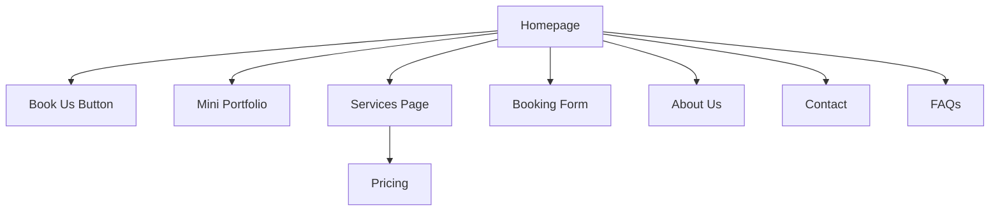

# SyncWell-Devs
# Website Booking Platform

A modern, responsive website for clients to book professional web development services. Built with HTML, Tailwind CSS CDN, and a clean user-friendly interface.

## ✨ Features

- Clean and professional homepage
- Booking form with custom inputs
- Services and pricing section
- Portfolio showcase
- About and contact pages
- FAQ and optional blog section
- Mobile-friendly and responsive design

## 📐 Tech Stack

- **HTML**
- **Tailwind CSS (via CDN)**
- **JavaScript (optional for interactivity)**

## 🧠 Structure (Simplified)

# Merged remote changes with local repository to resolve conflicts and integrate updates.

